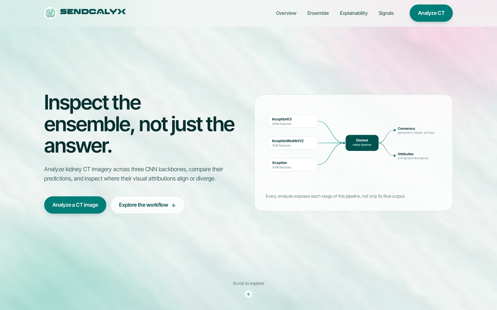

# SendCalyx

### Explainable Ensemble Intelligence for Kidney CT Imaging

> Inspect predictions from a multi-CNN kidney CT ensemble, quantify model consensus, and
> explore where visual attributions converge or disagree.

### [Live demo: sendcalyx.vercel.app](https://sendcalyx.vercel.app/)

[](LICENSE)
[](https://fastapi.tiangolo.com)
[](https://pytorch.org)
[](https://react.dev)

Version 0.1.0, deployed. The React frontend runs on Vercel and the FastAPI inference
service on Google Cloud Run.



---

## Overview

Most kidney-stone classifiers return one label and one number. SendCalyx returns the
reasoning trail behind that label.

A CT slice goes through three convolutional backbones (InceptionV3, InceptionResNetV2,
and Xception) whose six class probabilities feed a small stacked meta-learner. The system
then reports what each member of the ensemble decided independently, how far apart those
decisions were, and where in the image each network placed its attribution:

- per-model class probabilities and selected-class confidence,
- vote counts, agreement ratio, confidence spread, prediction margin, and normalised
  predictive entropy,
- pairwise Jensen-Shannon divergence across the base-model probability distributions,
- a Grad-CAM map per backbone,
- the pixel-wise mean of those maps, showing where attribution converges,
- the pixel-wise variance, showing where it diverges.

The point is inspectability. A confident ensemble built on a split vote is a different
object from a confident ensemble built on unanimity, and the interface treats it that way.
Every quantity above is a deterministic description of model behaviour on one image, not a
calibrated statement about the world.

**For research and educational use only. Not intended for clinical diagnosis or medical
decision-making.**

---

## Key features

| | |
| --- | --- |
| **Stacked ensemble inference** | Three ImageNet-scale CNN backbones with custom classifier heads, combined by a trained probability-level meta-learner. |
| **Per-model transparency** | Every base model's prediction, selected-class confidence, and full class distribution are returned alongside the ensemble output. |
| **Prediction consensus** | Vote counts, agreement ratio, unanimity, confidence spread, prediction margin, and normalised predictive entropy. |
| **Probability divergence** | Pairwise Jensen-Shannon divergence across base-model class distributions, catching disagreement that a vote count hides. |
| **Per-model Grad-CAM** | An attribution overlay for each backbone, taken at its last spatial feature map for the class that model selected. |
| **Attribution consensus** | Pixel-wise mean of the available Grad-CAM maps: where the ensemble consistently looks. |
| **Attribution disagreement** | Pixel-wise variance across those maps: where the ensemble looks differently. |
| **Input metadata** | Source dimensions, format, file size, and whether the image was upsampled to reach the model input size. |
| **Input guidance** | A guide on the landing page showing which kinds of image the ensemble is built for, and which to avoid. |
| **Graceful degradation** | A failed Grad-CAM does not fail the prediction; cross-model aggregation reports how many maps it actually used. |

---

## Architecture

```text
                       CT image (PNG / JPEG / WebP)
                                  │
                     resize 299x299, ImageNet normalisation
                                  │
        ┌─────────────────┬───────┴───────────┬─────────────────┐
        │  InceptionV3    │ InceptionResNetV2 │    Xception     │
        │  2048 features  │  1536 features    │ 2048 features   │
        │       ↓         │        ↓          │       ↓         │
        │ 256-128-2 head  │  256-128-2 head   │ 256-128-2 head  │
        └─────────────────┴───────┬───────────┴─────────────────┘
                ↓                 ↓                 ↓
          probabilities     probabilities     probabilities
                └─────────────────┼─────────────────┘
                                  │  6 features
                        stacked meta-learner
                       6 → 512 → 128 → 2 logits
                                  │
                         ensemble prediction
                                  │
              ┌───────────────────┴───────────────────┐
              ↓                                       ↓
     prediction consensus                    Grad-CAM per model
   votes, agreement, spread, margin,                  │
   entropy, probability divergence          ┌─────────┴─────────┐
                                            ↓                   ↓
                                     pixel-wise mean     pixel-wise variance
                                  (attribution consensus) (attribution disagreement)
```

**Repository layout**

```text
backend/
  app.py             FastAPI service: /, /health, /predict, /models
  app_utils.py       preprocessing, Grad-CAM, response assembly
  architectures.py   backbones, classifier head, StackedEnsembleNet
  analysis.py        consensus metrics, CAM aggregation, input metadata
  models/            trained checkpoints (Git LFS)
  tests/             analysis unit tests, no model loading
frontend/
  public/            logo, favicon set, Climax webfont
  src/components/    Header, Landing, EnsembleDiagram, InputGuide, UploadWorkspace,
                     EnsembleSummary, ConsensusPanel, MetricRail, ModelComparison,
                     SaliencyExplorer, InputMetadata, UsageNotice, Footer
  src/utils/api.js   API client and formatters
```

---

## Ensemble model

Two classes, in this fixed order: `Kidney_stone` (index 0), `Normal` (index 1).

Each base model is a frozen feature-extraction backbone with the same classifier head:

```text
features → Linear(256) → BatchNorm → ReLU → Dropout(0.2)
         → Linear(128) → BatchNorm → ReLU
         → Linear(2)
```

The meta-learner consumes the three models' six softmax outputs:

```text
Linear(6, 512) → ReLU → Dropout(0.2) → Linear(512, 128) → ReLU → Linear(128, 2)
```

Backbones are constructed without downloading ImageNet weights, because the shipped
checkpoints define every parameter and buffer and are loaded with `strict=True`. The
module configuration matches how each model was built at training time, including
InceptionV3's `transform_input=True`.

### Reproducibility and failure handling

- **Class ordering is fixed and explicit.** `Kidney_stone` is index 0 and `Normal` is
  index 1, matching the alphabetical ordering `ImageFolder` produced at training time. It
  is declared in one place and used consistently through inference, analysis, and the API.
- **Checkpoint loading is strict.** `strict=True` means a shape or key mismatch fails loudly
  at startup rather than silently producing a differently-wired model.
- **Readiness is atomic.** The meta-learner consumes exactly six features from three base
  models, so a partial load is unusable rather than degraded. The service reports itself
  ready only when all three backbones and the trained meta-learner have loaded; otherwise
  `/health` reports degraded and `/predict` returns 503. A randomly initialised
  meta-learner is never served, which is covered by the test suite.
- **Inference is deterministic.** Models run in `eval()` under `torch.no_grad()` except
  where Grad-CAM requires gradients, so repeated requests on the same image return the same
  numbers. Dependencies are pinned to the versions verified against these checkpoints.
- **Degradation is graceful and reported.** A failed Grad-CAM does not fail the prediction;
  cross-model aggregation proceeds on the maps that succeeded and reports how many it used.
- **Confidence is not uncertainty.** Model confidence, margin, entropy, and divergence are
  labelled throughout as descriptions of model behaviour, never as calibrated uncertainty or
  a probability that a prediction is correct.

---

## Prediction consensus

All of the following are computed in [`backend/analysis.py`](backend/analysis.py) from the
probabilities already produced during inference. They describe **model behaviour on one
input**. None of them is calibrated uncertainty, clinical uncertainty, or a probability
that a prediction is medically correct.

| Quantity | Definition |
| --- | --- |
| `votes` | Number of base models selecting each class. |
| `agreement_ratio` | Largest vote count ÷ number of base models. Three models give `1.0` or `≈0.667`. |
| `unanimous` | True only when every base model selected the same class. |
| `disagreement_flag` | `not unanimous`. |
| `confidence_spread` | Highest minus lowest **selected-class** confidence across base models. Each model contributes the probability it assigned to the class it chose. |
| `ensemble_margin` | \|P(Kidney_stone) − P(Normal)\| from the meta-learner output. |
| `ensemble_entropy` | Binary Shannon entropy of the ensemble probabilities, divided by `log 2`. Near `0` for a one-sided distribution, near `1` at an even split. Clipped with an epsilon so it stays finite. |
| `ensemble_matches_majority` | Whether the meta-learner agreed with the base-model majority. |
| `probability_divergence` | Pairwise Jensen-Shannon divergence across the base-model class distributions. See below. |

### Probability divergence

Vote counts answer whether the models agreed. They do not capture how far apart the
models were when they agreed, and three backbones can select the same class while
distributing probability mass very differently.

For every pair of base models, with `M = 0.5 * (P + Q)`:

```text
JSD(P, Q) = 0.5 * KL(P || M) + 0.5 * KL(Q || M)
```

Computed with log base 2, which bounds the result in `[0, 1]`: `0` for identical
distributions, `1` when two models place all their mass on different classes. Inputs are
renormalised and epsilon-clipped, so zero probabilities are safe.

The response carries every pair, plus `mean`, `max`, and `most_divergent_pair`. The
interface surfaces the mean, labelled "probability divergence". Like the other
quantities here it describes model behaviour, not uncertainty.

---

## Cross-model explainability

Grad-CAM is generated per base model at its last spatial feature map
(`Mixed_7c`, `conv2d_7b`, and `conv4` respectively), for the class that model selected.
Hooks are registered per map and released immediately afterwards.

The raw normalised maps are kept in memory long enough to aggregate them:

1. discard maps that are missing, non-2D, or non-finite;
2. rescale each surviving map to `[0, 1]`;
3. resize them to a common shape (backbones produce different grid sizes);
4. stack and take the pixel-wise **mean** and pixel-wise **variance**;
5. report `models_included`.

The mean map is rendered with the `jet` colormap, the variance map with `inferno`, so the
two views are not confused with each other. Attribution imagery deliberately keeps its own
scientific colormaps rather than being recoloured to match the interface.

If fewer than two valid maps exist, cross-model aggregation is reported as unavailable and
the individual maps and the prediction are still returned.

Grad-CAM marks regions a network was sensitive to. It is not causal evidence and not proof
of pathology.

---

## API

Four endpoints, with interactive docs at `/docs`. Examples below use
`http://localhost:8000`; in the deployed system the same API runs on Cloud Run behind the
frontend.

| Method | Path | Purpose |
| --- | --- | --- |
| `GET` | `/` | Service identity, version, readiness. |
| `GET` | `/health` | Device, loaded base models, missing components, and any checkpoint load errors. |
| `GET` | `/models` | Ensemble description, class ordering, model input size. |
| `POST` | `/predict` | Multipart image upload. Returns the full analysis. |

`/health` and `/models` report ready only when the complete ensemble has loaded; `/models`
and `/predict` return 503 otherwise.

`POST /predict` accepts PNG, JPEG, or WebP up to 10 MB. Unsupported types return `415`,
unreadable images `400`, oversized files `413`, and an unloaded model `503`.

```bash
curl -X POST http://localhost:8000/predict \
     -F "file=@slice.png;type=image/png"
```

```jsonc
{
  "ensemble": {
    "prediction": "Kidney_stone",
    "confidence": 0.9678,
    "probabilities": { "Kidney_stone": 0.9678, "Normal": 0.0322 }
  },
  "individual_models": {
    "inception_v3": {
      "display_name": "InceptionV3",
      "prediction": "Kidney_stone",
      "confidence": 0.9999,
      "probabilities": { "Kidney_stone": 0.9999, "Normal": 0.0001 },
      "gradcam_overlay": "<base64 PNG>",
      "gradcam_available": true
    },
    "inception_resnet_v2": { "…": "…" },
    "xception": { "…": "…" }
  },
  "consensus": {
    "votes": { "Kidney_stone": 3, "Normal": 0 },
    "num_models": 3,
    "majority_class": "Kidney_stone",
    "majority_votes": 3,
    "agreement_ratio": 1.0,
    "unanimous": true,
    "disagreement_flag": false,
    "confidence_spread": 0.0026,
    "ensemble_margin": 0.9356,
    "ensemble_entropy": 0.2053,
    "ensemble_matches_majority": true,
    "probability_divergence": {
      "pairwise": [
        { "models": ["inception_v3", "inception_resnet_v2"], "value": 0.0019 },
        { "models": ["inception_v3", "xception"], "value": 0.0012 },
        { "models": ["inception_resnet_v2", "xception"], "value": 0.0001 }
      ],
      "mean": 0.0011,
      "max": 0.0019,
      "most_divergent_pair": ["inception_v3", "inception_resnet_v2"],
      "available": true
    }
  },
  "xai_consensus": {
    "mean_gradcam": "<base64 PNG>",
    "variance_gradcam": "<base64 PNG>",
    "models_included": 3,
    "model_ids": ["inception_v3", "inception_resnet_v2", "xception"],
    "available": true
  },
  "input_metadata": {
    "width": 1052,
    "height": 1266,
    "format": "PNG",
    "file_size_bytes": 427052,
    "model_input_size": [299, 299],
    "below_recommended_resolution": false
  },
  "processing_time": 2.96,
  "num_models": 4,
  "success": true,
  "message": "Prediction completed successfully"
}
```

---

## Running locally

**Requirements:** Python 3.10+, Node 18+, and [Git LFS](https://git-lfs.com): the
checkpoints in `backend/models/` are LFS-tracked and total roughly 400 MB.

```bash
git clone https://github.com/Sys-Omertosa/SendCalyx.git
cd SendCalyx
git lfs pull
```

### Backend

```bash
python -m venv .venv
source .venv/bin/activate

# CPU-only wheels; drop the index URL for a CUDA build
pip install --index-url https://download.pytorch.org/whl/cpu torch torchvision
pip install -r backend/requirements.txt

python backend/app.py           # http://localhost:8000
```

CUDA is used automatically when a GPU-enabled PyTorch build reports it as available;
otherwise the service runs on CPU. A single CPU prediction, three backbones plus four attribution maps, takes a few
seconds.

Verify the ensemble loaded:

```bash
curl -s http://localhost:8000/health
```

### Frontend

```bash
cd frontend
npm install
npm run dev                     # http://localhost:5173
```

Point the client at a different API with `VITE_API_URL`:

```bash
echo "VITE_API_URL=http://localhost:8000" > frontend/.env.local
```

### Tests

```bash
python -m unittest discover -s backend/tests -t backend/tests
```

70 tests covering two areas.

**Analysis logic.** Consensus metrics, normalised predictive entropy, Jensen-Shannon
divergence, Grad-CAM aggregation, and input metadata, checked against hand-computed values
on small synthetic arrays.

**Service readiness.** The rule that the ensemble is usable only with all three base models
and the trained meta-learner, the atomicity of the loading path, the refusal to run stacked
inference on an incomplete ensemble, and the guarantee that a randomly initialised
meta-learner can never be served as though it were trained.

Both groups construct no CNN and read no checkpoint. The readiness tests patch the loading
internals so failure states are exercised deterministically. The real checkpoint path,
end-to-end prediction, and deployed behaviour are covered separately by smoke testing
against the running service.

### Docker

```bash
docker build -t sendcalyx-api backend/
docker run -p 8000:8000 -e PORT=8000 sendcalyx-api
```

---

## Deployment

SendCalyx runs at [sendcalyx.vercel.app](https://sendcalyx.vercel.app/). The two halves
deploy independently.

**Frontend.** Static Vite build hosted on Vercel. `VITE_API_URL` is set at build time to
the deployed API origin; it defaults to `http://localhost:8000` for local work.

**Backend.** Containerised FastAPI service on Google Cloud Run. The image is the one in
`backend/Dockerfile`, and the service binds to `$PORT`, which Cloud Run injects.
`SENDCALYX_ALLOWED_ORIGINS` takes a comma-separated list of origins permitted to call the
API, which is how the deployed frontend is authorised.

The backend scales to zero when idle. A request arriving after a period of inactivity
therefore waits on a cold start while roughly 400 MB of checkpoints load, so the first
analysis can take noticeably longer than subsequent ones. The frontend accounts for this:
its readiness probe retries with a short backoff and shows a starting state rather than
reporting the service as down.

Any container host that can run a CPU PyTorch image will serve the backend on the same
terms.

---

## Model training

The shipped checkpoints correspond to this training configuration:

| | |
| --- | --- |
| Input | 299 x 299 RGB, ImageNet mean/std normalisation |
| Loss | `CrossEntropyLoss` |
| Optimiser | Adam |
| Base-model schedule | 20 epochs with a frozen backbone, then 5 epochs fine-tuning the full network |
| Base-model learning rate | `1e-3`, with `StepLR(step_size=3, gamma=0.1)` during full fine-tuning |
| Meta-learner | 5 epochs at `1e-4` over the three frozen base models' probabilities |
| Batch size | 32 |

Augmentation expands each source image into eight variants: a resized original plus
vertical flip, horizontal flip, height shift, width shift, rotation, shear, and zoom.

**Backbone initialisation is not uniform.** InceptionV3 and InceptionResNetV2 start from
ImageNet weights. Xception is initialised without ImageNet pretrained weights in the
baseline training configuration, and therefore trains from random initialisation. The
architecture definitions preserve this so the checkpoints load exactly as trained.

### Evaluation

The checkpoints described above are the fixed baseline for v0.1.0. They are loaded with
`strict=True`, so the deployed system is running exactly the weights this configuration
produced.

This repository records no controlled evaluation of those weights, and therefore quotes no
accuracy figure. That is a deliberate choice rather than an omission: the dataset audit
below found cross-split duplicate contents and could not establish patient or study
independence, so any headline metric computed on that split would overstate what the model
has demonstrated. Publishing one would be misleading.

A controlled re-evaluation on a hash-cleaned, provenance-checked split is a separate
research track. When it is run, accuracy, precision, recall, F1, MCC, and a confusion
matrix will be recorded alongside the hardware, library versions, and checkpoint identity
used. That work concerns the strength of the evidence behind the weights, not the
completeness of the software: the inference, analysis, and explainability pipeline is
implemented, tested, and deployed as it stands.

### Relationship to published work

The ensemble design is **inspired by the stacked-ensemble methodology described in
published work on kidney-stone detection from CT imagery** (see
[Journal of King Saud University, Computer and Information Sciences, 2024](https://www.sciencedirect.com/science/article/pii/S1319157824002192)).
It is not a verified reproduction of that architecture: the implementation here uses three
base models and a specific meta-learner topology, and the published design may differ in
the number or identity of its base models. Where the paper and this code disagree, this
README describes the code that actually runs.

---

## Dataset sources

The checkpoints were trained on a hybrid dataset assembled from:

1. [Axial CT Imaging Dataset for Kidney Stone Detection](https://www.kaggle.com/datasets/orvile/axial-ct-imaging-dataset-kidney-stone-detection) (Kaggle);
2. CT data associated with Elazığ Fethi Sekin City Hospital, Turkey. See
   [Yildirim et al., *Computers in Biology and Medicine*](https://www.sciencedirect.com/science/article/abs/pii/S0010482521003632).

**No medical imagery is distributed with this repository.** Dataset licensing is separate
from software licensing, and redistribution rights for individual images have not been
independently established. Obtain the data from the sources above under their own terms.

---

## Limitations

These are the known boundaries of the current system, established by inspection and
audit rather than left undiscovered. Several of them are the reason the interface reports
model behaviour rather than a single verdict.

- **Cross-split duplicates are present, and split independence is unverified.** An
  exact-content hash audit of the 5,163 source images found 4,981 unique image contents,
  30 test images (1.99% of the test set) byte-identical to a training image, and 5 image
  contents appearing under both class labels. Patient or study-level independence could
  not be verified from the available metadata: the DICOM-style filenames share a single
  SOP root and carry no series-level grouping. Any reported accuracy should be read with
  that caveat.
- **Probabilities are uncalibrated.** No temperature scaling or other calibration has been
  applied. Confidence, margin, and entropy describe the shape of the model output, nothing
  more.
- **Grad-CAM is coarse.** Attribution is computed on a small feature grid (8 × 8 to 10 × 10)
  and upsampled, so it indicates broad regions of sensitivity, not lesion boundaries.
- **Attribution variance is relative.** The disagreement map is rescaled to its own maximum
  for display; brightness is comparable within one image, not across images.
- **Binary and slice-level.** The model distinguishes two classes on a single 2D slice. It
  does not localise, count, size, or stage anything, and has no notion of a study or volume.
- **Xception carries no ImageNet initialisation** in this checkpoint, unlike its two
  companions.
- **Domain shift is untested.** Behaviour on scanners, protocols, windowing, or populations
  outside the training data is unknown.
- **There is no out-of-distribution gate.** Uploads are validated as image files, not as
  kidney CT slices, so the ensemble will return a prediction for any decodable image
  including one from an entirely different domain. Such an output is meaningless. An
  input-domain screen built from the classifier's own penultimate features was evaluated
  and rejected: synthetic non-CT images scored inside the range of genuine CT slices, so
  the screen could not separate them reliably enough to gate on. The landing page carries
  input guidance instead.

---

## Usage and safety

For research and educational use only. Not intended for clinical diagnosis or medical
decision-making. SendCalyx is not a medical device, has not been clinically validated,
and must not be used to inform care for any patient.

Model confidence is not diagnostic certainty. Grad-CAM attribution is not proof of
pathology. Model disagreement is a signal about the models, not about a patient.

---

## License

Released under the [MIT License](LICENSE).

Third-party components (PyTorch, torchvision, `timm`, pretrained backbone weights, and
the medical imaging datasets referenced above) retain their own licenses and provenance
requirements. See [THIRD_PARTY_NOTICES.md](THIRD_PARTY_NOTICES.md).
